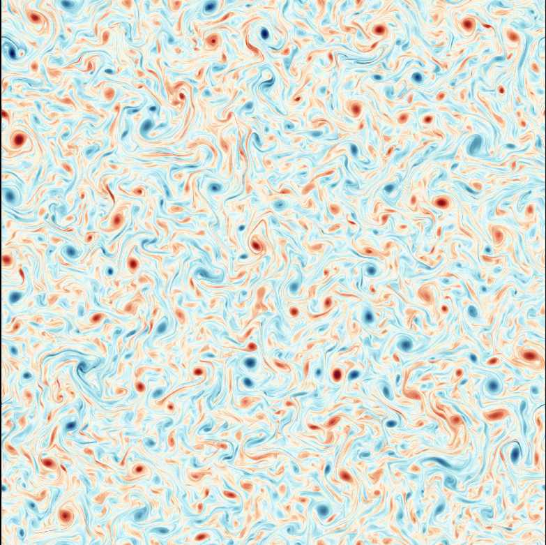
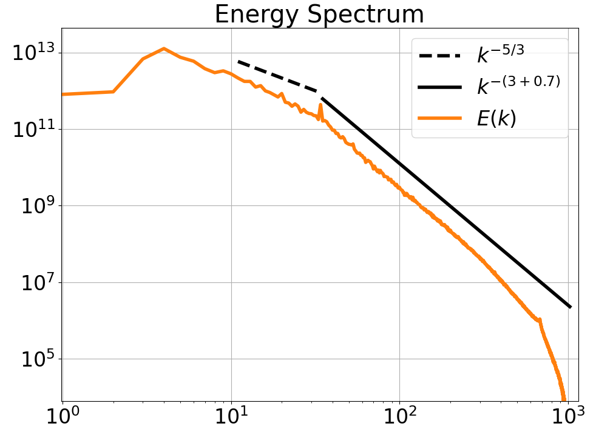

# PyTurb_2D

The python module *pyTurb* is an easy to use tool for simulating 2-dimensional hydrodynamic turbulence. *pyTurb* utilizes a pseudo-spectral method and enables the user to accelerate the code on a general purpose GPU to reach practical relevant resolutions.  

A detailed documentation of the code, including user instructions and theory of both 2-dimensional turbulence and numerical methods can be found in the file [docs_pyTurb.html](./docs_pyTurb.html)

    
    

      Resolution of 2048³. Left: Vorticity, Right: Energy Spectrum   Compare with Boffetta (2010), run A

