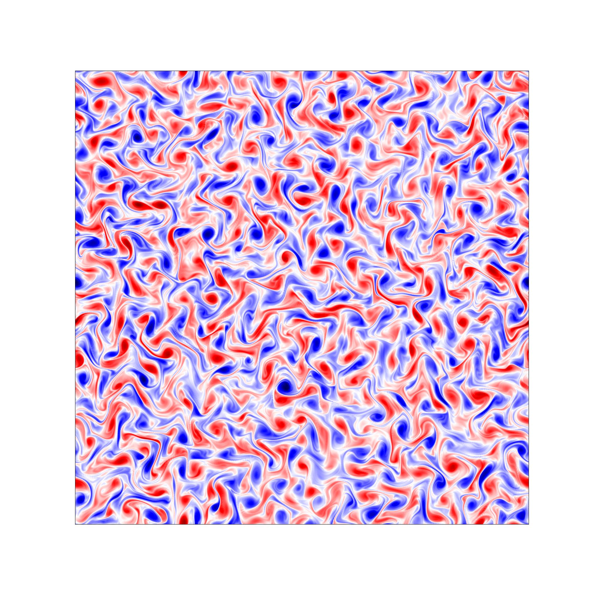

# pyTurb

## Introduction

In this project we will explore how to simulate 2-dimensional forced turbulence by means of the pseudo-spectral method.  
We will give a coarse introduction to the physical models of 2-dimensional turbulence followed by a discussion on the numerical methods suitable to efficiently simulate this natural phenomenon.  
The numerical methods discussed here are implemented in the python module *pyTurb*, which is available at my [github](https://github.com/MikeWilbert) page. To produce simulations with a practically relevant resolution, *pyTurb* uses the module *cupy* to accelerate the code on a single GPU.

<!-- <video width="720" height="720" controls poster="./../images/step_0960.jpg">
      <source src="./../images/movie.mp4" type="video/mp4">
</video>  -->

  

Above we see a simulation produced with *pyTurb*. It has a resolution of 1024 points in each spatial direction. For the shown 80 turn over times it took about 75 seconds on a A100 Nvidia GPU. It shows 2-dimensional turbulence forced from rest at a wavenumber of $k_f = 20$.

## pyTurb

### Download

The pyTurb project can be downloaded in the following ways:

ssh:  
`git clone https://github.com/MikeWilbert/pyTurb.git`

https:  
`git clone git@github.com:MikeWilbert/pyTurb.git`

### Test run

To start a first test run go to the code directory

`cd pyturb_2d/code`

There you will find the python module *pyTurb* as well as an example code that usesthe module to run a simulation. Additionally you will find the files *plot_stats.py* and *plot_spectra.py* which display makroscopic fluid quantities and the energy spectra produced printed during the simulations, respectively.

Before you run the execution script with

`python NS_GPU.py`

you might want to change the output directory as well as the resolution. You can also change other parameters. The patrameters for the simulations are described in detail in the next section.

### Functions

In the following the functions included in *pyTurb* are briefly described.

#### `init(N_, k_a_, k_f_, dk_f_ c_res_, out_dir_)`

Reads the parameters necessary to specify the simulation. This function needs to be called before any other *pyTurb* function.

| parameter | description |
| --- | --- |
| `N_` | # of grid points per direction |
| `k_a_` | linear friction wavenumber |
| `k_f_` | middle of forcing wavenumber band|
| `dk_f_` | width of forcing wavenumber band |
| `c_res_` | ratio of maximum resolved wavenumber to diffusion wavenumber $k_{max} / k_{\nu}$. Good value: 3, acceptable value: 1.5 |
| `out_dir_` | output directory |

#### `step()`

Performs a single time step.

#### `print_vtk()`

Prints the vorticity field in the vtk format to the output directory specified in the `init` function. That format constits of an XML header which describes the following binary data stored in the file. VTK files can be read e.g. by *Paraview* for visualization purposes.

#### `print_spectrum()`

Prints the energy spectrum and the corresponding simulation time to the file 'spectra.csv' that can be found in the output directory specified in the `init` function.

#### `print_stats()`

Prints the mean energy and dissipation rate and the corresponding simulation time to the file 'stats.csv' that can be found in the output directory specified in the `init` function.

For an example file to run a simulation with *pyTurb* we refer to the file 'code/NS_GPU.py'

## 2D Turbulence

In this section, the basic ideas and formulas behind the theory of 2-dimensional turbulence will be discussed.

### Vorticity equation

We start by considering the incompressible Navier-Stokes equations with an additional linear friction and a random force:

$$  \begin{align}
  
 \partial_t \mathbf{u} + \mathbf{u} \cdot \nabla \mathbf{u} = - \nabla p &+ \nu \Delta \mathbf{u} - \alpha \mathbf{u} \\ \nabla \cdot \mathbf{u} + \mathbf{f} &= 0 
\end{align}$$

| term | name | function |
| --- | --- | --- |
|  $\mathbf{u}$ | convection / non-linearity | veclocity transports itself
|  $\nabla p$ | pressure gradient | enforces incompressibility |
|  $\nu \Delta \mathbf{u}$ | viscous diffusion | dissipates energy at small scales |
|  $\alpha \mathbf{u}$ | linear friction | removes energy at large scales |
|  $\mathbf{f}$ | random force | inserts energy at a prescribed scale |

If we consider only 2-dimensional systems, it is more practical to formulate the incompressible Navier-Stokes equations in terms of the vorticity $\mathbf{\omega} = (\nabla \times \mathbf{u})$. 

Before taking the curl of the momentum equation (1), it is usefull to reformulate the non-linearity by applying the identity

$$ \frac{1}{2} \nabla |\mathbf{u}|^2 = \mathbf{u} \cdot \nabla \mathbf{u} + \mathbf{u} \times ( \nabla \times \mathbf{u} )$$

With that we find an evolution equation for the vorticity

$$\begin{equation}
   \partial_t \omega + \nabla \times ( \omega \times \mathbf{u} ) = \nu \Delta \mathbf{\omega} - \alpha \mathbf{\omega}.
  \end{equation}$$

Note that the vorticity is divergence free by definition $\left(\nabla \cdot ( \nabla \times \mathbf{u} ) = 0\right)$. Thus, no pressure term is needed in this formulation.

If we consider only 2 spatial dimensions, equations (3) can be simplified even further.

Assume the fluid velocity $\mathbf{u}$ is restricted to the x-y plane, then the vorticity vector $\mathbf{\omega}$ only has a non-zero component in the z-direction $\mathbf{\omega} = \omega \, \mathbf{\hat{e}}_z$.

Using the vector identity

$$ \nabla \times ( \mathbf{A} \times \mathbf{B} ) = \mathbf{B} \cdot \nabla \mathbf{A} - \mathbf{A} \cdot \nabla \mathbf{B} + \mathbf{A} ( \nabla \cdot \mathbf{B} ) - \mathbf{B} ( \nabla \cdot \mathbf{A} ) $$

and using the solenoidality of the velocity and the vorticity $(\nabla \cdot \mathbf{u} = \nabla \cdot \mathbf{\omega} = 0)$, we can write the non-linear term as

$$ \nabla \times ( \mathbf{ \omega } \times \mathbf{u} ) = \mathbf{u} \cdot \nabla \mathbf{\omega} - \mathbf{\omega} \cdot \nabla \mathbf{u} .$$

In the 2-dimensional case, the first term on the right-hand-side vanishes and we find the 2-dimensional version of the vorticity equation

$$\begin{equation}
   \partial_t \omega + \mathbf{u} \cdot \nabla \mathbf{\omega} = \nu \Delta \omega - \alpha \omega.
  \end{equation}$$

Note that this is only a scalar equation for the z-component of the vorticity.

Since the velocity field is divergence-free, it can also be written as the curl of a vector potential. In the 2-dimensional case this vector potential only has z-component that we wil call the stream function $\psi$.
As for the vorticity in 2D, we write $\mathbf{\psi} = \psi \mathbf{\hat{e}}_z$.

By expressing the veclocity by the stream function $( \mathbf{u} = \nabla \times \mathbf{\psi} )$ we find the stream fruntion formulation of the 2D vorticity equation

$$\begin{equation}
\boxed{
   \partial_t \omega = \nabla \psi \times \nabla \omega + \nu \Delta \omega - \alpha \omega.
}
\end{equation}$$

Finally, it would be more consistent to express the stream function $\psi$ by the vorticity $\omega$ instead of the velocity vector $\mathbf{u}$.  
This can be achieved by applying the vector identity $\nabla \times ( \nabla \times \mathbf{A} ) = \nabla (\nabla \cdot \mathbf{A}) -  \Delta \mathbf{A}$ to the definitions of $\omega$ and $\psi$.

$$ \mathbf{\omega} = \nabla \times \mathbf{u} = \nabla \times ( \nabla \times \mathbf{\psi}) = \nabla (\nabla \cdot \mathbf{\psi}) -  \Delta \mathbf{\psi} $$

Since the $\mathbf{\psi}$ only has one component in the z-direction and is restricted to the x-y plane, it has zero divergence and we end up with

$$ \begin{equation}
  \boxed{ \omega = - \Delta \psi }
\end{equation} $$

Equations (5) and (6) are the equations we are interested to solve.  

### A glance at turbulence

In 3-dimensional turbulence, the theory by Kolmogorov from 1941 is still most prominent.  
In a nutshell, it states that if energy is put into the system by some forcing mechanism, the non-linearity breaks up the eddies of this inertial scale into smaller eddys, which by themselfes break up into even smaller structures and so on. This is known as the *Richardson cascade*.
The Reynolds number $Re$, which denotes the ratio of the non-linear term to the diffusion, is typically a very high number, so that diffusion can be neglected in the cascade. But since $Re$ scales with the cosidered length scale, after a sufficient number of break ups, the eddies will be so small, that they feel the viscous friction and their energy dissipates into heat.  
Kolmogorov predicted a kinetic energy spectrum of the form
$$ E(k) \propto k^{-5/3} $$
and also gave the spacial and temporal scales where the diffusion sets in.  
For a more detailed and quantitative discussion about 3D turbulence, please consider the book by [Lautrup](https://www.lautrup.nbi.dk//continuousmatter2/index.html) or any other basic fluid dynamics book.

In the 2-dimensional case, the turbulent cascade changes its character in two ways. The basic theory for 2D turbulence was created by [Kraichnan](https://pubs.aip.org/aip/pfl/article-abstract/10/7/1417/440889/Inertial-Ranges-in-Two-Dimensional-Turbulence?redirectedFrom=fulltext) in his 1967 paper.  
First of all, the energy is transported to larger scales instead of smaller scales. This is called the inverse energy cascade. The inverse cascade obeys the same power law as in 3D Kolmogorov theory with a coefficient of $-5/3$. Since diffusion will only remove energy from the system at small scales, there is a need for an energy sink at large scales. In numerical simulations it is therefor common practice to introduce a linear friction term, which performs this task.  
The other special feature in 2D turbulence is the enstrophy cascade. Enstrophy is the analog to energy for the voriticvity, that is some measure of swirliness. This is a downward cascade and scales approximately as
$$ E(k) \propto k^{-3}, $$
although this slope should not be considered too strict, as there are also other theoretical predictions, e.g. slopes with $-4$ or $-11/3$. Kraichnan himself wrote in his original paper that the $-3$ slope "must be modified by factors with logarithmic $k$ dependence". For a discussion on the slope of the enstrophy cascade we refer to sections 9 & 10 of the review by [Tabling](https://www.sciencedirect.com/science/article/pii/S0370157301000643).

### Turbulence scales

Since numerical simulations are restricted to a finite range of scales, it is very important to know the relevant spatial scales that have to be resolved. In the case of 2D turbulence, there are 3 important scales.  
There is the *foring scale* associated with a wavenumber $k_f$ at which the energy is injected into the system. This scale depends on the choice of the forcing term.  
Then there is the *dissipation scale*, at which diffusion sets in and removes enstrophy from the system. This scale is associated with the diffusion term and especially with the viscosity $\nu$.  
Finally, we have the *friction scale* at which energy is removed from the system at large wavenumbers at the end of the inverse cascade. This is due to the linear friction force and will be a function of the friction coefficient $\alpha$.

#### Friction scale

Consider a differenctial equation, where the velocity is only changed by the linear friction force
$$ \partial_t \mathbf{u} = - \alpha \mathbf{u}. $$
Then we find a solution of the form
$$\mathbf{u}  \propto e^{- \alpha t}.$$
Here we see, that the coefficient $\alpha$ acts as the inverse of the time scale the linear friction acts on.  
By conservation of energy (see e.g. the original paper by Kraichnan) the maximum spatial scale reached by the inverse cascade as a function of time $t$ is given by 
$$L(t) \approx \epsilon^{1/2} t^{3/2}.$$
$\epsilon$ denotes the energy dissipation rate.  
Setting $\alpha$ as the inverse time in this formula leads an expression for the friction scale
$$k_\alpha \approx \frac{1}{L_\alpha} \approx \epsilon^{-1/2} \alpha^{3/2}.$$
By means of that relation we can specify the friction scale by setting the friction coefficient as
$$\begin{equation}
  \boxed{\alpha = \epsilon^{1/3} k_\alpha^{3/2}}.
\end{equation}$$
The energy dissipation $\epsilon$ must be equal to the energy production rate induced by the forcing, which we can specify explcitely by construction of the forcing term, as we will see later in this document.  

#### Dissipation scale  

In the original paper by Kraichnan we find an expression for the dissipation scale
$$k_\nu = \eta^{1/6} \nu^{-1/2}.$$
By assuming the relation between the dissipation rate of energy $\epsilon$ and the entsrophy dissipation rate $\eta$
$$\eta \approx k_f^2 \, \epsilon,$$
which makes sense when we look at the definition of those two quantities by their relation to the enrgy spectrum, we find an expression for the viscosity $\nu$ as a function of the forcing wavenumber $k_f$ and the dissipation scale $k_\nu$.
$$\begin{equation}
  \boxed{\nu = \epsilon^{1/3} k_f^{2/3} k_\nu^{-2}}
\end{equation}$$

In summary, we can provide the three relevant scales $k_\alpha$,  $k_f$ and $k_\nu$ and use the above relations to scale the forces in such a way that the evolving turbulence is restricted to this finite range of scales.

## Numerical methods

In this section we will consider the numerical methods used in *pyTurb* to solve equations (5) & (6).  
*pyTurb* is based the Fourier pseudo-spectral approach, which is very suitable for problems on periodic domains with infititely smooths solutions.

### Psuedo-spectral method

The main trick of the Fourier pseudo-spectral method is to exploit the fact that derivatives in physical space become multiplications with the wavevector in Fourier space.  
This can be easily shown for the one-dimensional case.
The basic idea of the Fourier transform is that every complex and integrable function $f(x)$ can be described by a superposition of plane waves, i.e.
$$ f(x) = \int \hat{f}(k) \, \exp(i\,k\,x) \, \text{d}k =: \mathcal{F}^{-1}(\hat{f})(x).$$  
$\mathcal{F}^{-1}$ is known as the *inverse Fourier transform*.
Here, the complex amplitude $\hat{f}$, which includes the amplitude and phase of the corresponding plane wave, is called the *Fourier coefficient* of $f$.  
Since the Fourier basis, i.e. the set consisting of the functions $\exp(i\,k\,x)$ for all real $k$, is orthonogonal, the Fourier coefficients can be expressed as 
$$ \hat{f}(k) = \frac{1}{2\,\pi} \int f(x) \, \exp(-i\,k\,x) \, \text{d}x =: \mathcal{F}(f)(k).$$
$\mathcal{F}$ is then called the *Fourier transform*.  

Now, consider the derivative of a function. Then we find
$$ f'(x) = \frac{\text{d}}{\text{d}x} \int \hat{f}(k) \, \exp(i\,k\,x) \, \text{d}k = \int i\,k\, \hat{f}(k) \, \exp(i\,k\,x) \, \text{d}k = \mathcal{F}^{-1}(i\,k\,\hat{f}(k)) = \mathcal{F}^{-1}(i\,k\,\mathcal{F(f)(k)}) $$
Thus, to take the derivative of f, we can transform to Fourtier space, multiply with $i\,k$ and then transform back to physical space. This procedure can easily be extended to vector valued functions:

$$\begin{align*}
  \mathcal{F}(\nabla \phi(\mathbf{x})) &= i \mathbf{k} \hat{\phi}(k)\\
  \mathcal{F}(\nabla \cdot \mathbf{u}(\mathbf{x})) &= i \mathbf{k} \cdot \hat{\mathbf{u}}(k)\\
  \mathcal{F}(\nabla \times \mathbf{u}(\mathbf{x})) &= i \mathbf{k} \times \hat{\mathbf{u}}(k)\\
  \mathcal{F}(\Delta \mathbf{u}(\mathbf{x})) &= - |\mathbf{k}|^2 \hat{\mathbf{u}}(k)
\end{align*}$$

Note also, that in Fourier space the Poisson equation can be solved quiet easily as the Laplace operator $\Delta$ can be simply inverted by dividing by $-|{k}|^2$.

Since we want to solve equations (5) & (6) on a computer, we are restricted to a finite number spacial samples of $f$ and thus we will deal with a finite number of Fourier modes. This leads from the Fourier integral to the discrete Fourier transform (*DFT*).

Let's consider the finite space interval $L = [0, 2\pi)$ and discretize it by $N$ points in space $x_j$ that are an equal distance $\Delta x = L/N$ apart. By now evalutating $f$ at these discrete points $f_j = f(x_j)$, with $x_j = j \, \Delta x, j = 0, \dots, N-1$, we define the discrete Fourier transform and its inverse as
$$DFT(f_j) := \sum_{j=0}^{N-1} f_j\,\exp(-i\,k\,x) =: \hat{f}_k $$
$$DFT^{-1}(\hat{f}_k) := \frac{1}{N} \sum_{k=-N/2}^{N/2-1} \hat{f}_k\,\exp(i\,k\,x) = f_j$$

The *DFT* assumes that the function $f$ can be described by a finite number of plane waves, which are infinetly smooths, periodic functions. Therefore, also $f$ needs to be periodic and infintely smooth. If that assumption is not fullfilled, it will show in the form of unphysical oscillations or a refelction of unresolvable modes into the spectrum.

The naive computation of the *DFT* gives a number of operations of the order $\mathcal{O}(N^2)$ (every $j$ with every $k$). This will become very expensive in terms of computation time if we want to compute high resolutions in multiple dimensions. 
This unconvencience is overcome by an algorithms called the *Fast Fourier Transform* (*[FFT](10.1090/S0025-5718-1965-0178586-1)*), which achieves a number of operations of $\mathcal{O}(N\,\log N)$, i.e. nearly optimal, by utilizing a divide-and-conquer approach based on the periodicty of the Fourier base.  

So far, the pseudo-spectral method can be summarized as follows: Compute the right-hand-side of equation (6) at discrete equidistant points by transforming the initial data to Fourier space using the FFT and compute the derivatives by multiplications with the wavevector. If the r.h.s. is evaluated this leaves us with an ordinary differential equation in time, for that a great variety of numerical methods exists. Also the stream function can easiy be computed in Fourier space by inverting the Laplace operator.  
The only thing we have not considered yet is the non-linear term. In our case it consists of the multiplication of two gradients. Unfortunately, multiplications in Fourier space become convultions in physical space. In discrete space, this is again an operation of order $\mathcal{O}(N^2)$. This can be avoided by first calculating the derivatives in Fourier space, then transforming to physical space and perform the multiplications there. Since we use the FFT for the transformations, we are back at $\mathcal{O}(N \log N)$.  
The main idea of the pseudo-spectral method can be summarized as follows:  
Compute derivatives in Fourier space, calculate multiplications in real space and transform between those two views by the efficient FFT.

### Dealiasing

Another issue associated with the multiplication in real space is that we need to double the number of Fourier modes to properly represent the result.
$$\begin{align*}
  f_j \, g_j &= \left( \sum_{k=-N/2}^{N/2-1} \hat{f}_k \exp( i\,x_j \, k ) \right) \, \left( \sum_{m=-N/2}^{N/2-1} \hat{g}_m \exp( i\,x_j \, m ) \right) \\
  &= \sum_{k,m=-N/2}^{N/2-1} \hat{f}_k \hat{g}_m \exp( i\,x_j \, (k+m) ) \\
\end{align*} 
$$
Thus, the resulting interval of discrete wavenumbers will be $[-2 N/2, 2 (N/2-1)]$. But we will surely not double the spatial resultion after every multiplication. Keeping the resultion fixed to the wavenumbers $[-N/2, N/2-1]$ then results in the unresolved wavenumbers being refected back into the other side of the resolvable spectrum, producing erroneous results. This can be seen by the following consideration.
$$ \begin{align*}
  
 \exp( i\, x_j\, k ) &= \exp( i\, 2\pi (j\,k) / N) \cdot 1 = \exp( i\, 2\pi j\,k / N) \cdot \exp( \pm i\, 2\pi \,  j ) = \exp( i\, 2\pi (j\, (k \pm N) / N) \\
 &= \exp( i\, x_j\, ( k \pm N ) )
 \end{align*}$$

E.g. if we have $N = 8$, the resolvable wavenumbers are in the discrete interval $[-4, 3]$. The wavenumber interval produced by the multiplication is $[-8, 6]$. The amplitude $\hat{f}_5$ will then be added to the amplitude $\hat{f}_{-1}$.

To circumvent this effect, we need to apply methods known as dealiasing methods. One of the most polular of these methods is the 2/3-rule proposed by Orszag in 1971.  
The method constists of deleting the highest 3rd of the spectrum and pad it with zeros instead. Then the multiplication is performed and afterwards the upper third of the spectrum of the result is padded again. Thereby the non-zero modes are only reflected into the upper third of the spectrum, and do not get mixed up with the correctly resolved modes. In the last step the faulty modes can simply be deleted. 
This method completely removes the aliaing error by the cost of reducing the resolution by a factor of 2/3. In higher dimensions the loss is even greater. Although this sounds pretty dramatic, the high accuracy and efficiency of the pseudo-spectral method is still superior compared to other numerical methods.  
More information about dealiasing methods and the pseudo-spectral method in general can be found e.g. in the book by [Canuto](https://link.springer.com/book/10.1007/978-3-540-30726-6).

### Time integration

Now that we have an efficient method at hand to evaluate the r.h.s. of the vorticity equation (6), we should think about how to advance the solution in time. This comes down to the numerical solution of ordinary differential equations (ODEs).

Let's look at a one-dimensional ODE of the general form

$$ y'(t) = f(y(t), t).$$

Usually we know $y$ at some start time $t_s$ and want to know it at some final later time $t_f$. Applying the Taylor expansion to $f$ gives

$$ y(t_f) = y(t_s) + y'(t_s) (t_f - t_s) + \mathcal{O}( (t_f-t_s)^2 ).$$

Truncating to second order will only give an acceptable error if the time interval $(t_f - t_s)$ is sufficiently small, which is generally not given.  
To overcome this difficulty, the time interval $(t_f-t_s)$ can be equally divided into $N$ parts. This givies the discretization $t_s =: t^0 < t^1 < \dots < t^{N-1} =: t_f$. Each discrete time $t^n$ is then seperated by the next time by a time interval $\Delta t = (t_f - t_s) / (N-1)$ and we have $t^n = n\,\Delta t + t_s$. Now we can use the truncated Taylor expansion above to move from one discrete time $t^n$ to the next $t^{n+1}$ until we have covered the whole interval of interest. If $N$ is high enough, then $\Delta t$ might be small enough that the error in each time step is small enough to get a reasonablly good approximation to $y(t_f)$.  
Each time step is then given by
$$ y^{n+1} = y^{n} + \Delta t f(y^n, t^n),$$
with $y^n$ being an approximation to $y(t^n)$. This method is called the *Euler forward* method. Each time step introduces an error of the order of $\mathcal{O}((\Delta t)^2)$. Thus, it is said that the Euler forward method has a local truncation error of order 2.  
But actually we are interested to arrive at $y(t_f)$. To do so we must perform $N$ Euler steps, each introducing an error of order $\mathcal{O}((\Delta t)^2)$. Since the number of steps $N$ depends also on the time interval $\Delta t$ as $N = (t_f - t_s) / \Delta t \propto 1/\Delta t$, the error to the final result is of order $1/\Delta t \, \mathcal{O}((\Delta t)^2) = \mathcal{O}((\Delta t))$. Therefore, the forward Euler method is said to have a global truncation error of order 1.  

This low order of accuracy implies that the we need a quiet high number of time steps $N$ to get an acceptable result, which in turn might be very expensive in terms of computation time. It is therefore desirable to create methods with higher order. The most common class of methods achieving arbitrary order of convergence
is the class of the so-called *Runge-Kutta* methods.  
The basic idea of these methods is no use the Euler method as a starting point to get an approximation of $y$ at some point in the time interval $(t^n, t^{n+1}]$. This gives two values in that interval that can then be combined to give a better approximation to a third one and so on. By combining the approximations in the time step interval in a clever way, methods of arbitarry order and possibly great stability can be created.

As an example, let us consider Heun's method. It is a second order method given by
$$\begin{align*}
  y_1 &= y^n + \Delta t f(y^n, t^n)\\
  y^{n+1} &= y^n + \Delta t \frac{f(y^n, t^n) + f(y_1, t^{n+1})}{2}
\end{align*}$$
In Heun's method the function $y$ is approximated at the end of the time step interval by the Euler forward method. Thus we have expresison for $f$ at the left and the right border of the interval and can use their mean value to approximate $f$ in the middle of the time step interval.

The method used in the module *pyTurb* is the *SSPRK3* method, short for *strong stability preserving Runge-Kutta method of order 3*. It consists of the following steps:

$$\begin{align*}
  y_1 &= y^n + \Delta t \, f(y^n, t^n)\\
  y_2 &= y^n + \frac{\Delta t}{2} \, \frac{f(y^n, t^n) + f(y_1, t^{n+1})}{2}\\
  y^{n+1} &= y^n + \Delta t \, \frac{f(y^n, t^n) + 4\,f(y_2, t^{n+1/2}) + f(y_1, t^{n+1})}{6}
\end{align*}$$

The SSPRK3 method thus uses Heun's method to get approximations to $f$ at the center and the right edge of the time step interval and combines them to a method of order 3.

So far, we have only considered the order of accuracy of the time integration schemes. Another important porperty of a numerical integration method is its stability. Stability refers to the fact that the errors made in each time step can amplify each other so that an unphysical exponential rise in the numerical approximation will occur if the time step is chosen too large.  
For the SSPRK3 method in 2 dimensions, which is used in *pyTurb*, the stability condition reads

$$\begin{align*}
  \Delta t \leq \frac{\sqrt{3}}{D_c + D_\nu},
\end{align*}$$

with 

$$\begin{align*}
  D_c &= \max \left( \pi \left( \frac{ 1 + |u_x| }{\Delta x} + \frac{ 1 + |u_y| }{\Delta x} \right) \right)\\
  D_\nu &= \max \left( \nu \,\pi^2 \left( \frac{ 1  }{(\Delta x)^2} + \frac{ 1 }{(\Delta x)^2} \right) \right).
\end{align*}$$

$D_c$ gives refers to the advection and $D_\nu$ to the diffusion.  
This stability criterion can be obtained by applying a Fourier transform to the advection-diffusion equation,which serves as a model problem. For more information we refer to the project by [Marin Lauber](https://github.com/marinlauber/2D-Turbulence-Python/blob/master/src/Theory.ipynb).

From the above stability condition, we observe that the time step $\Delta t$ depends on the grid spacing $\Delta x$. More specific, for the advection part, we have $\Delta t \propto \Delta x$ and for the diffusion we find $\Delta t \propto (\Delta x)^2$. We see that the stability condition arising from the diffusion is a way stronger restrcition on the spatial resolution.  

To overcome this difficulty with the diffusion term, we use the fact that the pure diffusion equation can be solved analytically in Fourier space. This allows us to formulate an ansatz by solving the diffusion term explicitely and thereby ommitting the stability restriction due to diffusion.

### Analytical diffusion

The diffusion equation in Fourier space is given by

$$ \partial_t \omega = - \nu \, k^2 \omega, $$

where for sake of simplicity we ommit the hat symbol over the vorticity symbol $\omega$.

The solution of this equation is simply given by

$$ \omega = \omega(t=0) \, \exp(- \nu \, k^2\,t).$$

Now we write the vorticity equation (5) in the form

$$ \partial_t \omega = \mathcal{L}(w) - \nu \, k^2 \omega, $$
 with $\mathcal{L}$ including the non-linear term and additional forces.

 The solution of the diffusion equation motivates the ansatz

 $$ \omega = \tilde{\omega} \, \exp(- \nu \, k^2\,t). $$

 Comparing the partial time derivative of the above equation with the general form of the vorticity equation, we find

 $$ \partial_t \tilde{\omega} = \mathcal{L}(\omega) \, \exp(+ \nu \, k^2\,t). $$
 Thus, we can treat the diffusion anaylitically and solve for the other terms with a numerical method by advancing $\tilde{\omega}$ in time and afterwards computing $\omega$. By that precedure, we get rid of the stability condition imposed by the diffusion term.  
Note that the time derivative of $\tilde{\omega}$ depends on $\omega$.

For the implementation of this ansatz for the SSPRRK3 solver please take a look at the file *pyTurb.py*.

### Forcing

Finally, to simulate 2D turbulence in an equilibrium state we have to define a forcing term that drives the turbulence. The approach used in *pyTurb* is to generate Gaussian white noise in a certain band of wavenumbers. The strength of the foring can be explcitely set by calculating the energy in the band-passed white noise and rescale the forcing to inject a predefined amount of energy. The timescale of the forcing is set to $\Delta t$. This means that the forcing is the same in every Runge-Kutta substep.

Since we can choose the energy injection rate freely, we will set it in such a way that the time scale of the simulations will be equal to the eddy turnover time associated with the energy injection. In analogy with 3-dimensional turbulence, we will call it the *large eddy turnover time* $T$, altough it does not refer to the largest eddies in 2-dimensional turbulence.  
$T$ can be defined by
$$T := \frac{L}{U},$$
with the characteristic length and velocity scales $L$ and $U$ respectively.  
Additionally, we can approximate the energy injection rate by
$$\epsilon \approx \frac{U^2}{T} = \frac{U^3}{L} \approx U^3 \, k_f.$$
Combining the two above relations, we find an expresseion for the large eddy turnover time as a function of the forcing only.
$$T_L = \epsilon^{-1/3} \, k_f^{-2/3}$$
Thus, by setting
$$\epsilon = k_f^{-2}$$
we will have $t=T$ in our simulations.
